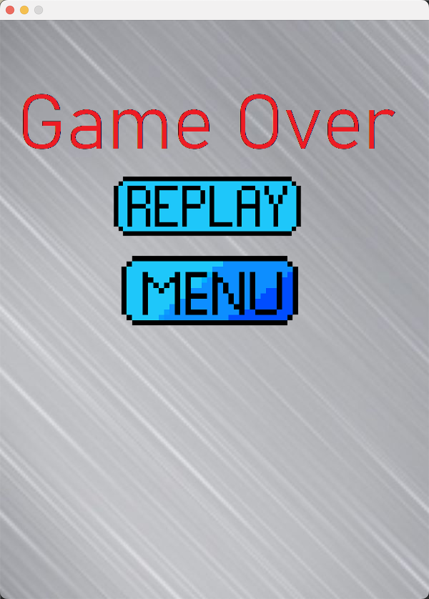
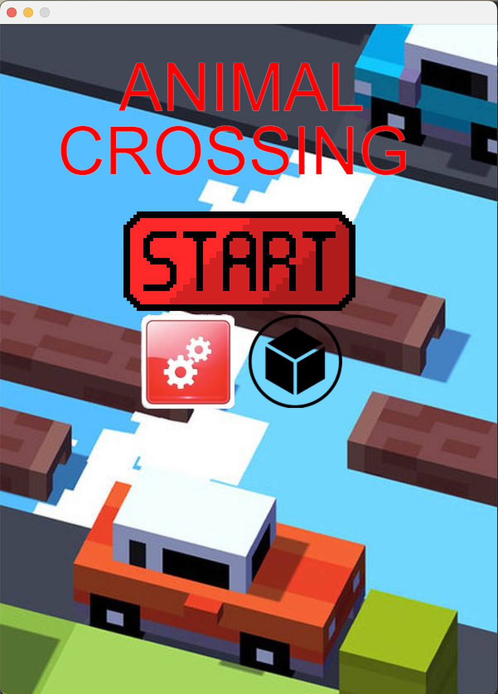
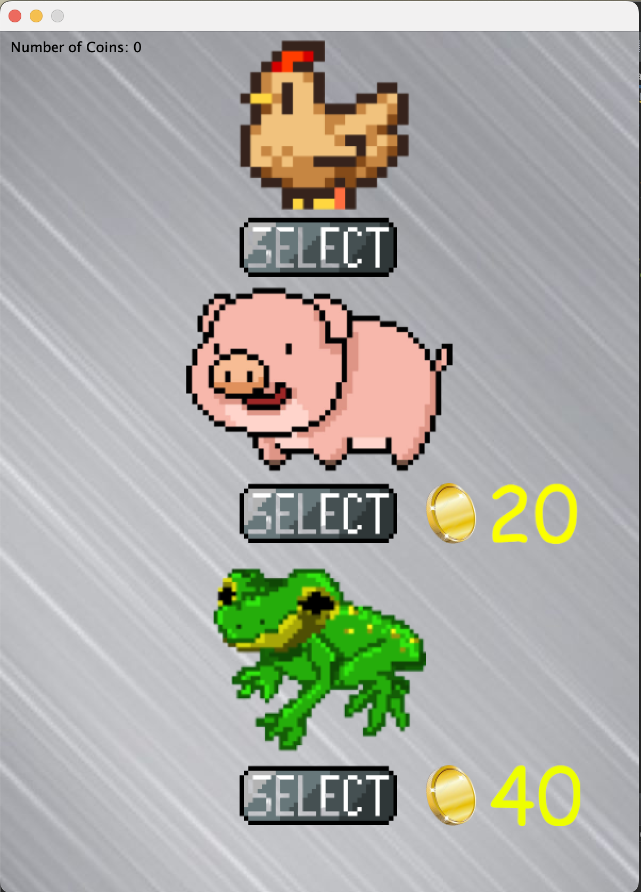
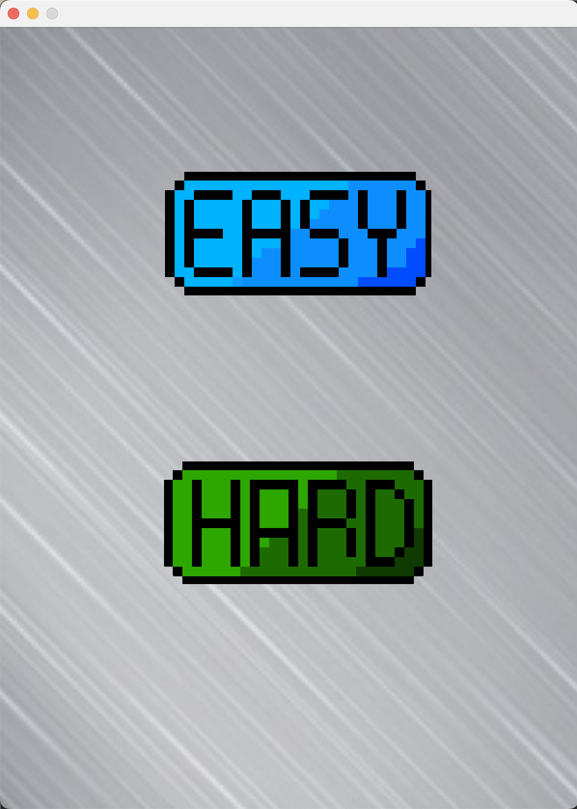
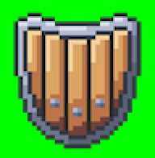
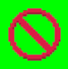
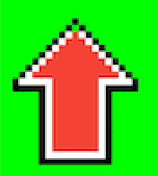
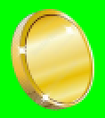
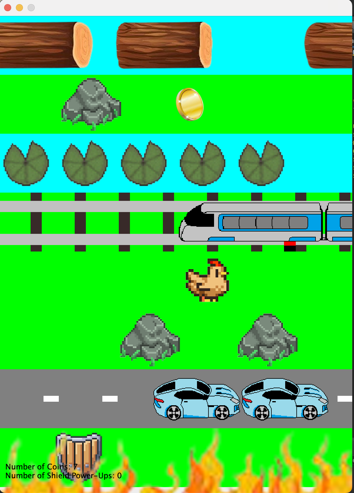

# Crossy Road With Power-Ups
A take on the classic game "Crossy Road" with a spin of Power Ups, coded in Java.

## Contributors
Code and Images By: Alejandro Reilly, Owen Korper, and Mark Frigiani.

## Graphics
Graphics done with Java's JFrame graphics library.
All sprites designed by Alejandro Reilly and Mark Frigiani.

## Gameplay
<b>OBJECTIVE</b>
The goal of the game is to get the highest score possible (which is incremented by progressing a row further) and to collect coins, which can be found randomly generated on the screen.

<b>LOSING</b>
The player loses if they come into contact with an obstacle - whether that is a car, a train, a rock, a river, or the <i>Fire</i>. What is the Fire one may ask? If the player stays idle for too long, a fire will slowly creep up from the bottom of the screen, to encourage the player to move forward. The fire resets after the player reaches the other end of the screen and generates a new map. 
When you lose, the GAME OVER screen will appear (picture below), and you can choose to Replay or go to the Landing Page A.K.A. 'Menu'\

## Pages
<b>LANDING PAGE</b>
On the landing page, the user can chooose whether or not to play the game, choose their difficulty/setting, or to choose their character in the shop.\

<b>CHARACTER SHOP</b>
Using coins selected in-game, the player can buy either a Pig or a Frog sprite.\

<b>DIFFICULTY/SETTINGS PAGE</b>
The player can choose either an 'Easy' or 'Hard' difficulty. The Fire moves a lot slower in easy mode than in hard mode.\

## Power-Ups
| Power-Up | Description | Image     |
| :---: |  :----:  |  :---: |
| Shield | Will protect the user from one obstacle. Can be stacked, and amount is displayed on the bottom.       |   |
| Cancel|Will cancel out all the obstacles on the current screen.| |
|Arrow| Will allow the player to jump two spaces per forward move for ten seconds.||
|Coin| In-Game currency that can be used in the shop. The amount is displayed on the bottom.| |

## Obstacles and Rows
The possible rows to generate and move through on the screen are as follows:
-<i>Grass:</i> Completely safe!
- <i>Lily Pads:</i> Don't land in the water!
- <i> Rocks:</i>If you come into contact with one, you lose.
- <i> Cars:</i> These can generate from either the left or right side, and have a random speed. AVOID THEM!
- <i>Logs:</i> These also generate from the left or ride side with a random speed, and the objective is to stand on them and not land in the water. Don't stand too long, or your game will end when you reach off-screen!
- <i>Trains:</i> Trains will appear on the tracks after the light blinks three times. They come fast, so steer clear!

## In-Action

<i>All types of rows and obstacles generated one one screen. Average gameplay appearance</i>

# HAVE FUN